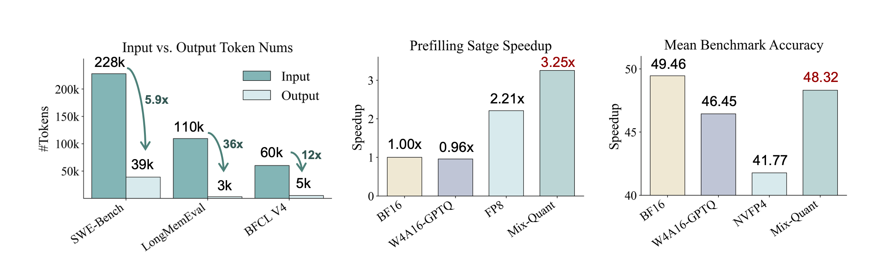
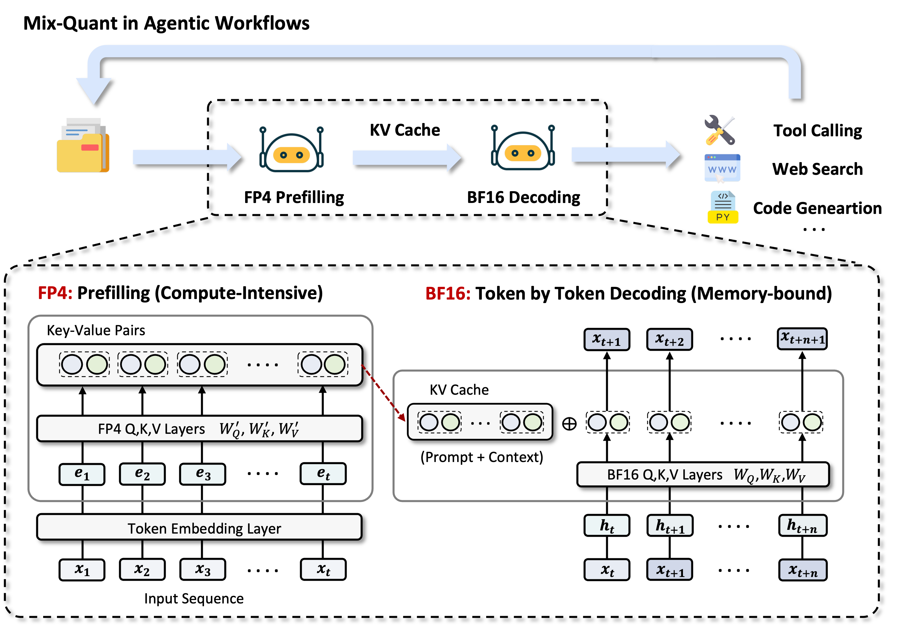

<div align="center">
  <h1> Mix-Quant: Quantized Prefilling, Precise Decoding for Agentic LLMs </h1>

  <div>
    <a href="https://arxiv.org/abs/2605.20315">
      
    </a>
    <a target="_blank" href="https://haiquanlu.github.io/Mix-Quant/">
      
    </a>
  </div>
</div>

<!-- <p>Agentic LLM inference is highly input-heavy, creating substantial prefilling overhead; Mix-Quant accelerates this bottleneck with NVFP4 prefilling while preserving BF16 decoding quality.</p> -->




> [**Mix-Quant: Quantized Prefilling, Precise Decoding for Agentic LLMs**](https://arxiv.org/abs/2605.20315)   
> *[Haiquan Lu](https://github.com/haiquanlu), [Zigeng Chen](https://czg1225.github.io/chenzigeng99/), [Gongfan Fang](https://fangggf.github.io/), [Xinyin Ma](https://horseee.github.io/), [Xinchao Wang](https://sites.google.com/site/sitexinchaowang/)*    
> *[xML Lab](https://sites.google.com/view/xml-nus), National University of Singapore*

------------------

## Introduction

Agentic LLM workflows repeatedly process long contexts from tools, memory, retrieval, and reasoning traces, making prefilling a key inference bottleneck. However, applying low-bit quantization throughout inference can degrade generation quality due to error accumulation.
**Mix-Quant** addresses this with a phase-aware inference strategy: it applies high-throughput **NVFP4 quantization** to the compute-intensive prefilling stage, while keeping autoregressive decoding in **BF16** for stable and reliable generation. This design accelerates long-context agentic inference while largely preserving downstream task performance.


<!--  -->
<div align="center">
  
  <br>
  <em>Overview of Mix-Quant.</em>
</div>


## Installation

```bash
# Create a new conda environment
conda create -n mix-quant python=3.12 -y
conda activate mix-quant

# Clone the repository with submodules
git clone --recurse-submodules https://github.com/haiquanlu/Mix-Quant.git
cd Mix-Quant/vllm

# Install the modified vLLM
# Note: Mix-Quant is implemented on top of a modified vLLM fork, 
# included as a Git submodule for reproducibility.
# Option 1: Install with the pre-compiled vLLM wheel.
# Recommended if the pre-compiled vLLM wheel is compatible with your environment.
export VLLM_PRECOMPILED_WHEEL_COMMIT=28ee78af543c563a2fbf78829a7688120e4e4eb5
VLLM_USE_PRECOMPILED=1 pip install --editable .
# Option 2: Build vLLM from source.
# Do NOT run this command if you have already installed vLLM with Option 1.
# pip install --editable .

# Install other packages
cd ..
pip install -r requirements.txt
```


## Quick Start
Mix-Quant uses a prefill-decode disaggregated serving pipeline. The script below launches a quantized prefill server, a BF16 decode server, and a lightweight proxy server. After the proxy is ready, users can send standard OpenAI-compatible requests to `http://localhost:8595/v1`.

### 1. Start the serving pipeline

```bash
# Run from the repository root.
bash scripts/run_server_qwen3.sh \
  --prefill-model-name RedHatAI/Qwen3-8B-NVFP4 \
  --decode-model-name Qwen/Qwen3-8B \
  --prefill-gpu 0 \
  --decode-gpu 1 \
  --tensor-parallel-size 1 \
  --max-model-length 131072 \
  --proxy-port 8595
```

### 2. Send a request to the proxy

```python
from openai import OpenAI

client = OpenAI(
    api_key="EMPTY",
    base_url="http://localhost:8595/v1",
)

response = client.chat.completions.create(
    model="Qwen/Qwen3-8B",
    messages=[
        {
            "role": "user",
            "content": "Explain the key idea of Mix-Quant in one sentence.",
        }
    ],
)

print(response.choices[0].message.content)
```

## Evaluation

The public evaluation entry points are in `scripts/`. Start the serving pipeline first, then run the benchmark scripts from the repository root.
### 1. Evaluation on Reasoning Benchmarks

Supported datasets are `math500`, `aime24`, `aime25`, and `gsm8k`.

Start the server with native context settings by clearing `--hf-overrides`:

```bash
bash scripts/run_server_qwen3.sh \
  --prefill-model-name RedHatAI/Qwen3-8B-NVFP4 \
  --decode-model-name Qwen/Qwen3-8B \
  --prefill-gpu 0 \
  --decode-gpu 1 \
  --tensor-parallel-size 1 \
  --max-model-length 40960 \
  --hf-overrides ''
```

Then run the evaluation script:

```bash
# Run the default reasoning set: math500, aime24, aime25.
bash scripts/eval_qwen3_reasoning.sh \
  --seed 42 \
  --max-concurrent-requests 32
```

Results are saved to `evaluation/reasoning/results/Qwen3-8B/thinking/`. 

### 2. Evaluation on Longbench-v2 Benchmark

The LongBench-v2 script uses the `Qwen3-8B` model key from `evaluation/longbench-v2/config/`. 

```bash
bash scripts/eval_qwen3_longbench-v2.sh \
  --seed 42 \
  --save-dir results/qwen3-8b
```

Predictions and per-example correctness are written as JSONL files under `evaluation/longbench-v2/results/`.

### 3. Evaluation on LongMemEval Benchmark

Prepare the LongMemEval data file first:

```base
mkdir -p evaluation/LongMemEval/data/
cd evaluation/LongMemEval/data/
wget https://huggingface.co/datasets/xiaowu0162/longmemeval-cleaned/resolve/main/longmemeval_s_cleaned.json
```

Then run generation:

```bash
bash scripts/eval_qwen3_longmemeval.sh \
  --data-file data/longmemeval_s_cleaned.json \
  --seed 42 \
  --save-dir results/qwen3-8b
```

The generation outputs are saved under `evaluation/LongMemEval/results/`. LongMemEval QA scoring uses an LLM judge. To run judging in the same command, install the optional judge dependencies, set `OPENAI_API_KEY` and optionally `OPENAI_BASE_URL`, then pass a supported judge model:

```bash
pip install -r evaluation/LongMemEval/requirements.txt
export OPENAI_API_KEY=your_api_key
bash scripts/eval_qwen3_longmemeval.sh \
  --data-file data/longmemeval_s_cleaned.json \
  --judge-model gpt-4o
```

The judge output is written next to the prediction file with the `.eval-results-<judge-model>` suffix.

## Citation

```
@article{lu2026mixquant,
  title={Mix-Quant: Quantized Prefilling, Precise Decoding for Agentic LLMs},
  author={Lu, Haiquan and Chen, Zigeng and Fang, Gongfan and Ma, Xinyin and Wang, Xinchao},
  journal={arXiv preprint arXiv:2605.20315},
  year={2026}
}
```

## Acknowledgements

This project builds on several excellent open-source efforts. We sincerely thank the community for their contributions:
- [vllm](https://github.com/vllm-project/vllm)
- [llm-compressor](https://github.com/vllm-project/llm-compressor)
- [evalscope](https://github.com/modelscope/evalscope)
- [FP-Quant](https://github.com/IST-DASLab/FP-Quant)
